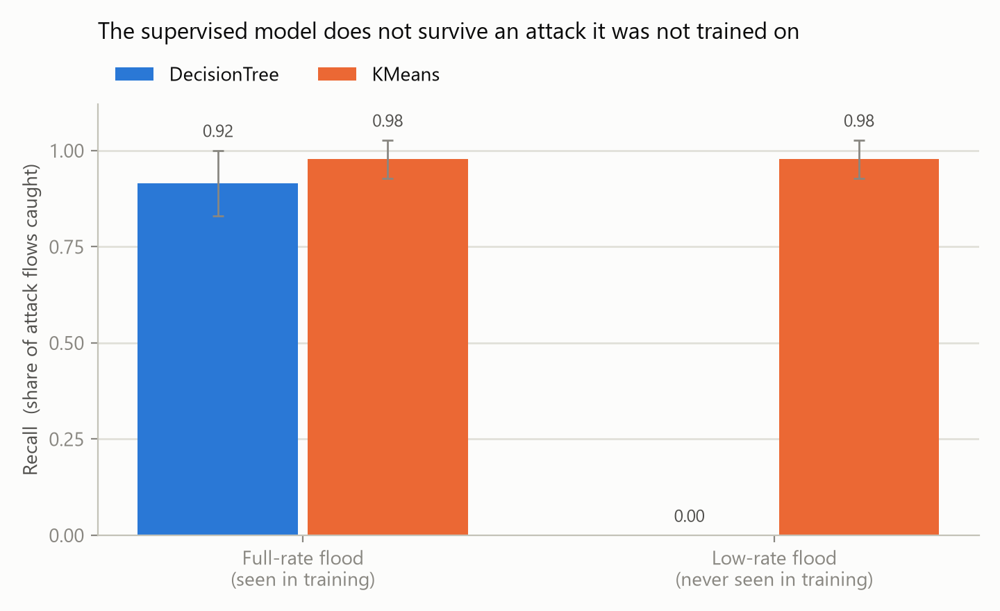
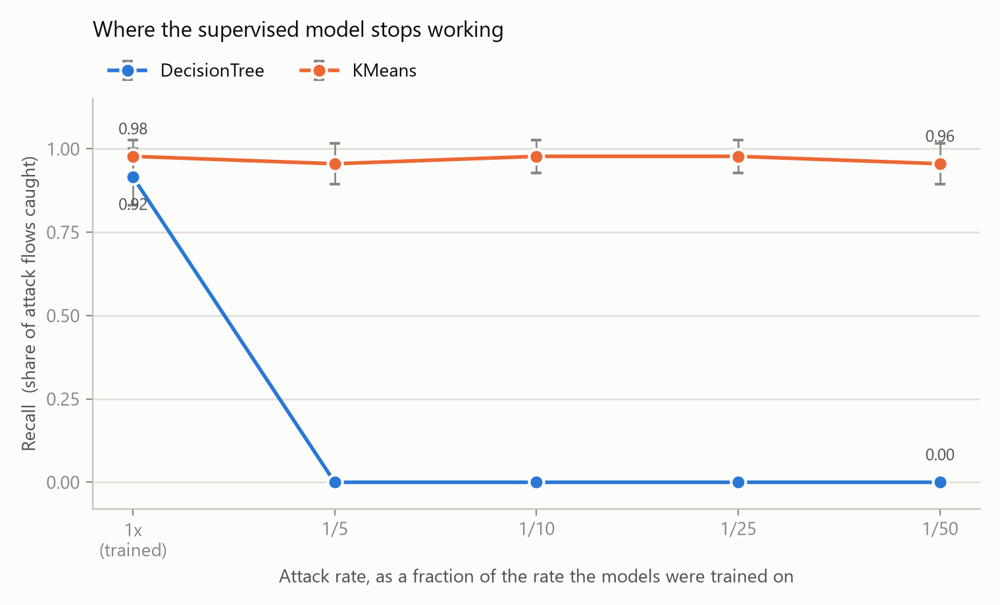

# Comparative Analysis of Supervised and Unsupervised Machine Learning for DDoS Detection and Dynamic Port Blocking in Software-Defined Networks

Simulation project built on OMNeT++ + INET + OpenFlow.

## Goal

Detect DDoS attacks in an SDN network using two different machine learning
approaches, block the attacker automatically, and compare how the two
approaches perform.

| | Supervised | Unsupervised |
|---|---|---|
| Model | Decision Tree | K-Means |
| Needs labelled attack data | Yes | No |
| Learns | Normal vs attack | What normal looks like |

**Attacks simulated:** UDP flood, TCP SYN flood
**Mitigation:** dynamic DROP rule installed on the attacker's switch port

## Folder layout

| Folder | Contents |
|---|---|
| `simulations/` | NED topology files, `omnetpp.ini` run configs |
| `src/` | C++ modules - traffic generators, feature collector, controller app |
| `ml/` | Python training scripts (scikit-learn) |
| `data/` | Collected traffic features (CSV) |
| `results/` | Simulation output, metrics, graphs |
| `docs/` | Setup notes |

## Pipeline

```
OMNeT++ network  ->  traffic (normal + attack)
                       |
                 feature collector
                       |
                  CSV dataset
                       |
        Python: train Decision Tree + K-Means
                       |
       export rules / centroids back into C++
                       |
          controller detects -> DROP rule
                       |
            measure + compare results
```

## Status

- [x] Project scaffold
- [x] Toolchain installed and compiling (OMNeT++ 6.0.2 + INET 3.8.5 + OpenFlow)
- [x] Stock OpenFlow scenario verified running
- [x] ML pipeline: training, evaluation, C++ export (validated on synthetic data)
- [x] Project topology running: 3 clients, 2 attackers, victim, OF switch, controller
- [x] UDP flood traffic, verified end to end (victim receives 41,545 packets;
      each attacker sends 20,001 vs 481 from a normal client)
- [x] Flow counters + stats reporting, with zero changes to the vendored model
- [x] Feature collection to a labelled CSV
- [x] Retrained on real simulator data
- [x] Both models running inside the simulator, blocking attackers
- [x] Three-way comparison producing real numbers
- [x] Shared access switch, so `port_src_count` is a real signal
- [x] Second attack type: low-rate flood, used as the unseen-attack test
- [x] 5 seeded repetitions per configuration + comparison graphs
- [ ] A true spoofed SYN flood (see the note in `omnetpp.ini`)

## Results

Mean over 5 seeded repetitions, 60 s each. Models are trained on the
**full-rate** attack only; the low-rate rows are an attack they never saw.

| Attack | Detector | Victim rcvd | Blocked | Recall | FP |
|---|---|---|---|---|---|
| full-rate | none | 99,390 | 0 | - | - |
| full-rate | Decision Tree | 10,078 | 89,313 | 0.92 | 0.0 |
| full-rate | K-Means | 9,223 | 91,446 | 0.98 | 8.8 |
| low-rate | none | 4,398 | 0 | - | - |
| low-rate | Decision Tree | **4,398** | **0** | **0.00** | 0.0 |
| low-rate | K-Means | 688 | 4,610 | 0.98 | 7.0 |



**The finding.** On the attack it was trained on, the Decision Tree is
excellent - 0.92 recall with zero false positives. On an attack 25x quieter
that it never saw, it catches **nothing**: recall 0.00, and the victim receives
exactly as many packets as with no protection at all. K-Means holds at 0.98
across both, because it only ever needed to know what normal looks like.

**The cost.** K-Means pays for that with ~7-9 false positives per run -
legitimate flows blocked. The Decision Tree blocks none. That is the trade,
and it is visible in the network rather than asserted in a table.

Blocks last `blockDuration` (10 s by default) and then lapse, so a false
positive costs a bounded amount of legitimate traffic instead of being fatal.

### Where exactly the Decision Tree breaks

Sweeping the attack rate (5 intensities x 5 seeds, models never retrained):



| Attack rate | DT recall | K-Means recall | K-Means FP |
|---|---|---|---|
| 1x (trained on) | 0.92 | 0.98 | 8.8 |
| 1/5 | **0.00** | 0.96 | 8.4 |
| 1/10 | **0.00** | 0.98 | 9.2 |
| 1/25 | **0.00** | 0.98 | 7.0 |
| 1/50 | **0.00** | 0.96 | 8.8 |

There is no gradual decline. The Decision Tree goes from 0.92 to zero the
moment the attack is quieter than what it trained on, and stays there.

You can read why straight out of the generated model - the entire tree is:

```c
if (f[1] <= 116465.5) return 0;   // byte_rate
else                  return 1;
```

The full-rate attack runs at ~345,000 B/s, above the threshold. At 1/5 rate it
is ~69,000 B/s, below it - so every attack flow is classified normal. The tree
learned one number, and any attack on the wrong side of it is invisible.

A detail worth noting: at 1/5 rate the Decision Tree lets **20,210** packets
through, twice as many as at full rate (10,078). It protects the victim worse
against a weaker attack, because at full rate it at least blocked something.

## Running it

**Open the right terminal first.** Double-click `shell.cmd` in this folder. It
opens the OMNeT++ MSYS2 terminal already in the project directory. Every `.sh`
command below must be typed there - PowerShell, cmd and Git Bash do not have
the OMNeT++ toolchain and will fail.

(Equivalent by hand: run `D:\omnetpp-6.0.2\mingwenv.cmd`, then
`cd /d/IUT/3-2/DP2/SDN-DDoS-ML`.)

Python steps are the exception - run those from PowerShell with the project's
virtual environment, `.venv\Scripts\python.exe`.

**Confirm the setup works** before anything else:

```
bash check_setup.sh
```

It checks OMNeT++, the compiler, the GUI, INET, the OpenFlow model, this
project's build, the trained models and the Python packages - then runs a real
30-second simulation and confirms traffic reached the victim and an attacker
was blocked. Every failure prints the command that fixes it.

OMNeT++ on Windows is a portable folder at `D:\omnetpp-6.0.2`, not an
installed app, so it will not appear in the Start menu or Windows search. To
open the OMNeT++ IDE itself (not needed to run this project), use
`D:\omnetpp-6.0.2\mingwenv.cmd ide`.

```
bash build.sh                           # compile the C++ modules
bash compare.sh 60s                     # one run of each config, quick table
bash experiments.sh 5 60s               # 5 seeds x 6 configs -> results/experiments.csv

bash run.sh Collect      Cmdenv 60s     # produce the labelled dataset
bash run.sh NoProtection Cmdenv 60s     # attack unopposed (baseline)
bash run.sh DecisionTree Cmdenv 60s     # supervised detection + blocking
bash run.sh KMeans       Cmdenv 60s     # unsupervised detection + blocking
bash run.sh NoAttack     Cmdenv 60s     # healthy network, no attackers
bash run.sh HubOnly      Cmdenv 60s     # diagnostic: flood everything
bash run.sh DecisionTree Qtenv          # watch it in the GUI
```

Retraining on freshly collected data:

```
cd ml
python inspect_csv.py ../data/flows_sim.csv     # always check first
python train.py --train ../data/flows_sim.csv --k 3
cd .. && bash build.sh                           # headers changed, recompile
```

Graphs from a completed sweep:

```
cd ml && python plot_results.py ../results/experiments.csv
```

`inspect_csv.py` is not optional. It is what caught `port_src_count` being a
constant and `pair_flow` reading 1 for every flow - both of which would have
produced perfectly good-looking and completely meaningless accuracy numbers.

## How the missing flow statistics were solved

The OpenFlow model has no flow-statistics message (no `OFP_Stats_Request` /
flow-stats reply) and its flow table entries store only `creationTime`,
`lastMatched` and the timeouts - **no packet or byte counter anywhere**. Three
of the six features had nothing to read.

Rather than fork the model, `DDoSSwitch` subclasses `OF_Switch`:
`handleMessage` is virtual and the members are protected, so it can tap the
data plane, keep its own per-flow counters, and drop blocked traffic. The
report travels to the controller on the OpenFlow vendor channel
(`OFPT_VENDOR`), which the controller already forwards to apps as a
`PacketExperimenter` signal.

**The vendored model is an unmodified checkout.** Nothing is patched.

Two further points that fell out of this:

- With flows properly installed the controller sees `numPacketIn = 7` out of
  ~41,000 packets, so a detector built on packet-in events would be blind.
  Switch-side measurement is required, not merely tidier.
- A flow-mod cannot express a drop: the switch reads an output port straight
  out of the matched entry and has no concept of an empty action list. And
  `disablePorts()` only affects flooding, not forwarding. So `DDoSSwitch`
  implements the drop itself, driven by a `DDoSBlockCommand`.

See `docs/setup.md` for installation and the working run command.
